# Задание 1. Формализация ПДД

# Содержание

<!-- vim-markdown-toc Marked -->

* [Требования](#требования)
* [Презентация работы](#презентация-работы)
    * [Пример #1](#пример-#1)
        * [Работа алгоритма](#работа-алгоритма)
    * [Пример #2](#пример-#2)
* [Алгоритм](#алгоритм)
* [Константы](#константы)
    * [Общие константы](#общие-константы)
    * [Ж/Д светофор](#ж/д-светофор)
    * [Приоритеты](#приоритеты)
    * [Знаки](#знаки)
    * [Разметка](#разметка)
    * [Положения регулировщика](#положения-регулировщика)
    * [Знаки, разрешающие проезд](#знаки,-разрешающие-проезд)
* [Правила](#правила)
    * [Общие правила](#общие-правила)
    * [ТС](#тс)
        * [Проезд перекрестков](#проезд-перекрестков)
            * [Проезд перекрестка с круговым движением](#проезд-перекрестка-с-круговым-движением)
        * [Движение по автомагистрали](#движение-по-автомагистрали)
        * [Обгон](#обгон)
        * [Опережение](#опережение)
        * [Встречный разъезд](#встречный-разъезд)
        * [Остановка](#остановка)
        * [Стоянка](#стоянка)
        * [Проезд пешеходных переходов (наличие знака 23)](#проезд-пешеходных-переходов-(наличие-знака-23))
        * [Движение в жилых зонах (наличие знака 22)](#движение-в-жилых-зонах-(наличие-знака-22))
        * [Буксировка](#буксировка)
            * [Гибкая сцепка](#гибкая-сцепка)
            * [Жесткая сцепка](#жесткая-сцепка)
        * [Проезд ЖД путей](#проезд-жд-путей)
        * [Проезд мест остановки общественного транспорта (знаки 24-26)](#проезд-мест-остановки-общественного-транспорта-(знаки-24-26))
    * [Пешеход](#пешеход)
        * [Переход проезжей части (наличие знака 23)](#переход-проезжей-части-(наличие-знака-23))

<!-- vim-markdown-toc -->

# Требования
Необходимо формализовать правила дорожного движения для их последующего использования.
В итоге должен получиться набор правил, с помощью которых участники дорожного движения могут передвигаться по дорогам общего пользования, соблюдая правила дорожного движения.

# Презентация работы

## Пример #1

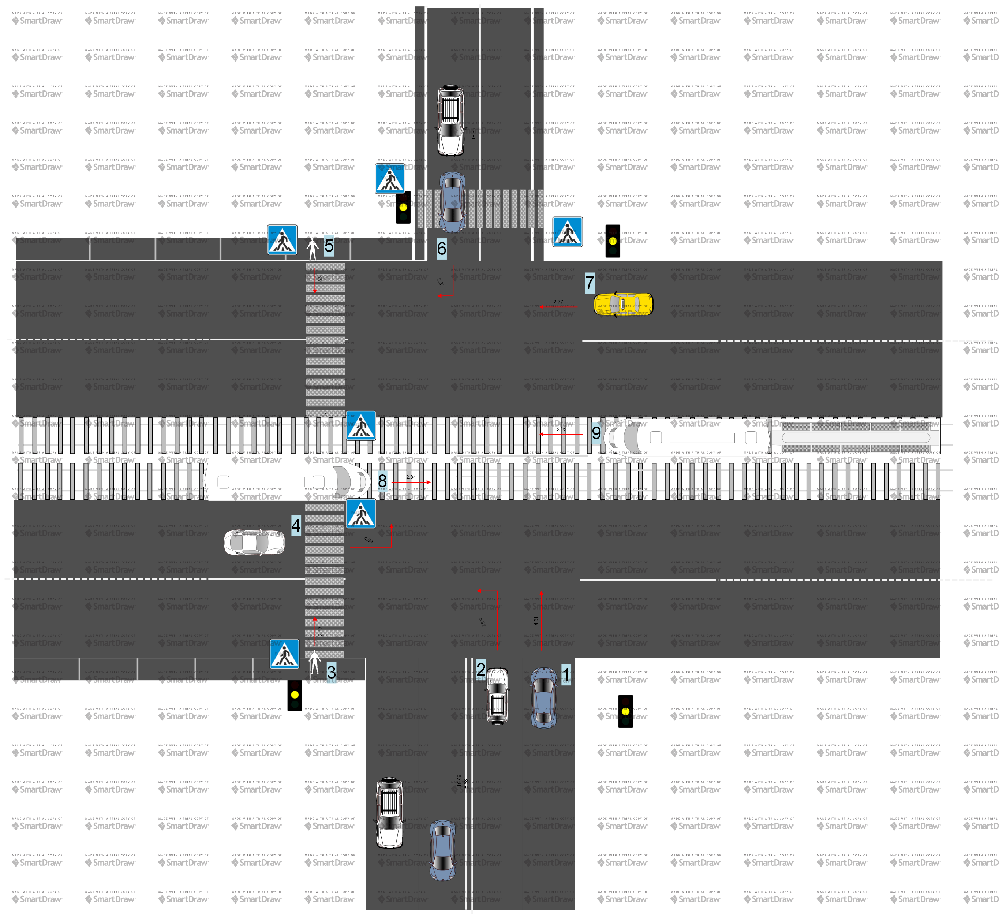

На схеме изображены 9 участников дорожного движения, у каждого есть номер и планируемое направление движения.

Правильная модель движения здесь следующая:

- перекресток нерегулируемый, потому как светофор не работает (каждый мигает желтым сигналом);
- изначально поедут трамваи 8 и 9, потому как они не создают помехи пешеходам, а остальные участники движения в данном случае менее приоритетные.
- ТС 6 проедет до пешеходного перехода и будет ждать, пока пройдет пешеход;
- ТС 7 проедет вперед за ТС 6, так как у ТС 7 уже не будет помехи справа;
- ТС 1 и 2 проедут по намеченному маршруту; ТС 2 будет ждать, пока пройдет пешеход 5;
- последним проедет ТС 4, при условии, что не создаст помеху пешеходу 3.

### Работа алгоритма

## Пример #2

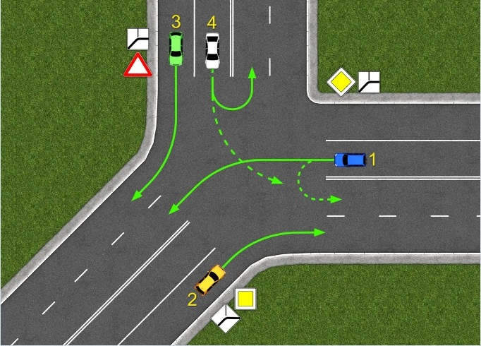

# Алгоритм

Есть очередь событий Q, откуда, пока очередь не пуста, каждый квант времени выбирается событие si. Событие задаётся входными условиями/внешней информацией. К событиям могут быть привязаны обработчики, обозначающие поведение/изменение поведения субъекта.
Для простоты принято, что во время обработки очередного события, события до него обработаны верно. Таким образом, отпадает нужда создания механизма ошибок и их обработки.

[есть событие] -> найти требуемые действия в зависимости от условий.

[действия найдены] -> выполнить и ждать следующее событие.

[действия не найдены] -> остановится и ждать следующее событие.

# Константы

## Общие константы

Разрешающий светофор = зелёный.

Запрещающий светофор = красный или желтый.

Дополнительные территории с запрещенной остановкой = эстакады; мосты; путепроводы.

Приоритет ниже = субъект с более низшим приоритетом уступает дорогу субъекту с более высоким приоритетом.

## Ж/Д светофор

| #   | Изображение              | Значение           |
| --- | ---                      | ---                |
| 1   | 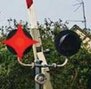 | Запрещает движение |
| 2   | 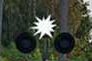 | Разрешает движение |

## Приоритеты

| #   | Источник выдвижения требований |
| --- | ---                            |
| 1   | Регулировщик                   |
| 2   | Временный дорожный знак        |
| 3   | Дорожный знак                  |
| 4   | Временная дорожная разметка    |
| 5   | Дорожная разметка              |

## Знаки

| #   | Изображение          | Значение (необязательно)                                                                                                                    |
| --- | ---                  | ---                                                                                                                                         |
| 1   | 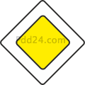  | Двигаться с приоритетом выше знака 36, 37                                                                                                   |
| 2   | 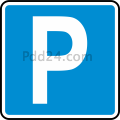  | В данном месте разрешена стоянка и остановка                                                                                                |
| 3   |   |                                                                                                                                             |
| 4   | 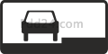  |                                                                                                                                             |
| 5   |   |                                                                                                                                             |
| 6   |   |                                                                                                                                             |
| 7   | 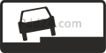  |                                                                                                                                             |
| 8   | 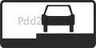  |                                                                                                                                             |
| 9   |   |                                                                                                                                             |
| 10  |  |                                                                                                                                             |
| 11  | 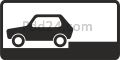 |                                                                                                                                             |
| 12  | 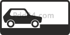 |                                                                                                                                             |
| 13  |  |                                                                                                                                             |
| 14  |  |                                                                                                                                             |
| 15  | 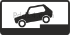 |                                                                                                                                             |
| 16  |  |                                                                                                                                             |
| 17  |  |                                                                                                                                             |
| 18  | 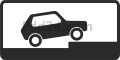 |                                                                                                                                             |
| 19  | 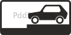 |                                                                                                                                             |
| 20  |  |                                                                                                                                             |
| 21  | 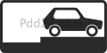 |                                                                                                                                             |
| 22  | 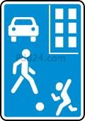 |                                                                                                                                             |
| 23  | 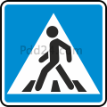 |                                                                                                                                             |
| 24  | 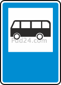 |                                                                                                                                             |
| 25  | 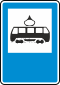 |                                                                                                                                             |
| 26  | 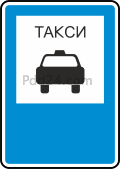 |                                                                                                                                             |
| 27  | 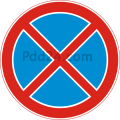 | Остановка запрещена                                                                                                                         |
| 28  | 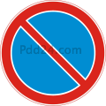 | Стоянка запрещена                                                                                                                           |
| 29  | 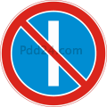 | Стоянка запрещена по нечетным дням                                                                                                          |
| 30  | 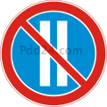 | Стоянка запрещена по четным дням                                                                                                            |
| 31  | 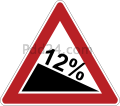 |                                                                                                                                             |
| 32  | 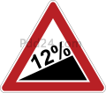 |                                                                                                                                             |
| 33  | 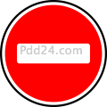 | Проезд по дороге, после знака запрещен                                                                                                      |
| 34  | 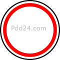 | Сквозной проезд по обозначенной дороге запрещен                                                                                             |
| 35  | 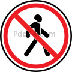 | Движение пешеходов запрещено                                                                                                                |
| 36  | 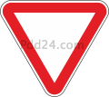 | Приоритет меньше, чем у тех, чья дорога обозначена знаком 1                                                                                 |
| 37  | 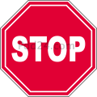 | Требуется остановиться, через перекресток двигаться с наименьшим приоритетом                                                                |
| 38  | 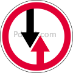 | Приоритет у встречного транспорта                                                                                                           |
| 39  | 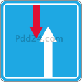 | Приоритет над встречным транспортом                                                                                                         |
| 40  | 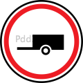 | Запрещено движение с прицепом и буксировка ТС                                                                                               |
| 41  | 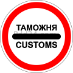 | Требуется остановка у таможни                                                                                                               |
| 42  | 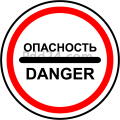 | Проезд запрещен любым участникам дорожного движения                                                                                         |
| 43  | 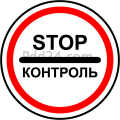 | Требуется остановка у контрольного пункта                                                                                                   |
| 44  | 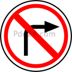 | Поворот направо запрещен                                                                                                                    |
| 45  | 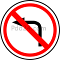 | Поворот налево запрещен                                                                                                                     |
| 46  | 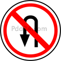 | Разворот запрещен                                                                                                                           |
| 47  | 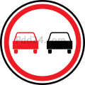 | Обгон запрещен                                                                                                                              |
| 48  | 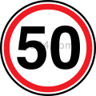 | Требуется ограничить скорость согласно числу, написанному на знаке                                                                          |
| 49  | 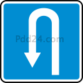 | Запрет поворота налево, разрешен разворот                                                                                                   |
| 50  | 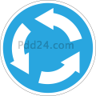 |                                                                                                                                             |
| 51  | 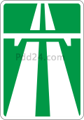 | Запрет движения задним ходом, запрет разворота и съезда в разрывы разделительной полосы, остановки в местах не обозначенных знаком 2 или 53 |
| 52  | 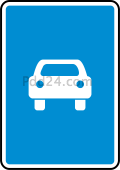 | См. знак 51                                                                                                                                 |
| 53  | 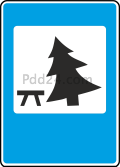 | Место длительной стоянки                                                                                                                    |

## Разметка

| #   | Изображение       | Значение (необязательно)                                                                                              |
| --- | ---               | ---                                                                                                                   |
| 1   | 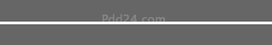 | запрещается выезд за границы обозначений полосы                                                                       |
| 2   | 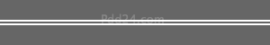 | запрещается выезд за границы обозначенной полосы                                                                      |
| 3   | 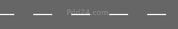 | разрешается пересечение границ обозначенной полосы                                                                    |
| 4   |  | разрешается пересечение границ обозначенной полосы                                                                    |
| 5   |  | разрешается пересечение границ обозначенной полосы только со стороны штриховой разметки                               |
| 6   |  | стоянка запрещена на протяжении всей линии разметки                                                                   |
| 7   |  | остановка запрещена на протяжении всей линии разметки                                                                 |
| 8   |  | остановка разрешается только для посадки и высадки пассажиров при отсутствии помех в сторону общественного транспорта |
| 9   |  | допускается пересечение при остановки                                                                                 |

## Положения регулировщика

| #   | Положение                     | Разрешающее направление |
| --- | ---                           | ---                     |
| 1   |  |                         |
| 2   |  | прямо, направо          |
| 3   |  |                         |
| 4   |  |                         |
| 5   |  | все направления         |
| 6   |  |                         |
| 7   |  | направо                 |
| 8   |  |                         |

## Знаки, разрешающие проезд

| #   | Знаки                                                    | Разрешающее направление |
| --- | ---                                                      | ---                     |
| 1   |    | прямо                   |
| 2   |    | направо                 |
| 3   |    | налево                  |
| 4   | все, разрешающие движение налево                         | разворот                |

# Правила

## Общие правила

[был распознан дорожный знак, в таблице есть значение] -> выполнить требования согласно значению.

[была распознана дорожная разметка, в таблице есть значение] -> выполнить требования соглсано значению.

[требования распознанного знака противоречат требованиям распознанной разметки] -> выполнить требования знака.

[противоречие знака и разметки, противоречие регулировщика и знака, противоречие регулировщика и разметки] -> выполнить требования наименьшего номера по таблице приоритетов.

## ТС

### Проезд перекрестков

[регулируемый светофором, разрешающий цвет, разрешающий знак] -> движение в разрешенном направлении.

[регулировщик, разрешенное направление] -> движение в разрешенном направлении.

[нерегулируемый, разрешающий знак] -> движение в разрешенном направлении.

#### Проезд перекрестка с круговым движением

[наличие знака 50] -> двигаться с более низким приоритетом.

[был совершен въезд на перекресток с круговым движением] -> двигаться с приоритетом большим, чем у въезжающих.

### Движение по автомагистрали

[есть знак 51] -> продолжить движение с ограничение скорости в 110 км/ч.

### Обгон

[предпологаемая полоса обгона пуста, разрешающая разметка, обгоняемый ТС не совершает обгон, нет запрещающих знаков, ТС двигается не по пешеходному переходу, ТС не в конце подъема с ограниченной видемостью, ТС не на мосту, путепроводе, эстакаде, до ЖД переезда >= 100 м] -> совершение обгона.

### Опережение

[выбранная полоса свободна, ТС в других полосах не замедляют ход перед пешеходным переходом] -> опережение ТС по выбранной полосе.

### Встречный разъезд

[есть затруднения во встречном разъезде, нет знаков 31 и 32, на пути движения есть препятствие] -> двигаться с приоритетом ниже, чем в встречных ТС.

[есть затруднения во встречном разъезде, нет знаков 31 и 32, на пути движения нет препятствий] -> двигаться с приоритетом выше, чем в встречных ТС.

[есть затруднения во встречном разъезде, есть знак 31] -> двигаться с приоритетом ниже, чем в встречных ТС.

[есть затруднения во встречном разъезде, есть знак 32] -> двигаться с приоритетом выше, чем в встречных ТС.

### Остановка

[не на трамвайных путях, при остановке не будут созданы помехи трамваям, не на железнодорожном переезде, не на дополнительных территориях с запрещённой остановкой при < 3 полосах, остаётся 3+ метра для объезда или обгона, до пешеходного перехода остаётся не менее 5 метров, видимость в близи опасных участков дороги с двух сторон более 100 метров, до следующей остановки общественного ТС не менее 15 метров, до пересечения проезжих частей не менее 5 метров, не будут созданы помехи для движения велосипедистов по велосипедной дорожке, не будут созданы помехи пешеходам при переходе через проезжую часть] -> остановка ТС.

### Стоянка

[остановка в данном месте не запрещена, вне населенного пункта нет знака 1, до ЖД переезда не менее 50 метров, при наличии знака 2 для выбора положения учтены знаки 3-21] -> постановка ТС на стоянку.

### Проезд пешеходных переходов (наличие знака 23)

[регулируемый светофором, разрешающий цвет, нет помехи при движении] -> продолжить переезд.

[нерегулируемый, есть видимость двух сторон перехода, нет пешеходов на переходе] -> продолжить переезд.

[нерегулируемый, нет видимости перехода, соседние ТС не останавливаются] -> продолжить переезд.

### Движение в жилых зонах (наличие знака 22)

[движение не будет сквозным] -> продолжить движение с меньшим, чем у других участников приоритетом.

### Буксировка

#### Гибкая сцепка

[нет гололеда, работает рулевая система буксируемого ТС, работает тормозная система буксируемого ТС] -> продолжить буксировку.

#### Жесткая сцепка

[работает рулевая система буксируемого ТС] -> продолжить буксировку.

### Проезд ЖД путей

[регулируется светофором, разрешающее состояние, после Ж/Д путей нет затора] -> продолжить проезд.

[регулируется шлагбаумом, шлагбаум поднят, после Ж/Д путей нет затора] -> продолжить проезд.

### Проезд мест остановки общественного транспорта (знаки 24-26)

[отъезжает общественный транспорт] -> уступить дорогу.

## Пешеход

### Переход проезжей части (наличие знака 23)

[регулируется светофором, резрешающий цвет] -> продолжать переход.

[регулировщик, регулировщик находится справа, регулировщик в положении 6] -> продолжить движение.

[регулировщик, регулировщик находится слева, регулировщик в положении 5] -> продолжить движение.

[нерегулируемый, есть реакция от водителей] -> продолжить движение.

