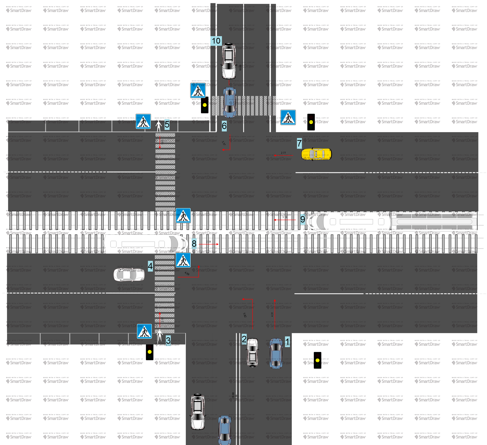
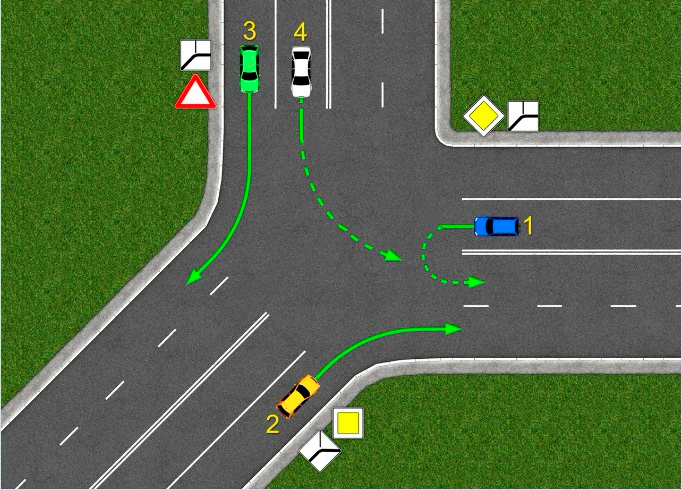

# Задание 1. Формализация ПДД

# Содержание

<!-- vim-markdown-toc Marked -->

* [Требования](#требования)
* [Презентация работы](#презентация-работы)
    * [Пример #1](#пример-#1)
        * [Участники движения](#участники-движения)
        * [Описание схемы](#описание-схемы)
        * [Описание работы алгоритма](#описание-работы-алгоритма)
    * [Пример #2](#пример-#2)
        * [Участники движения](#участники-движения)
        * [Описание схемы](#описание-схемы)
        * [Описание работы алгоритма](#описание-работы-алгоритма)
* [1. Алгоритм](#1.-алгоритм)
* [Константы](#константы)
    * [Общие константы](#общие-константы)
    * [Ж/Д светофор](#ж/д-светофор)
    * [Приоритеты](#приоритеты)
        * [Приоритеты требований](#приоритеты-требований)
        * [Приоритеты участников дорожного движения](#приоритеты-участников-дорожного-движения)
    * [Знаки](#знаки)
    * [Разметка](#разметка)
    * [Положения регулировщика](#положения-регулировщика)
    * [Знаки, разрешающие проезд](#знаки,-разрешающие-проезд)
* [Правила](#правила)
    * [2. Общие правила](#2.-общие-правила)
    * [ТС](#тс)
        * [3. Проезд перекрестков](#3.-проезд-перекрестков)
            * [3.1. Проезд перекрестка с круговым движением](#3.1.-проезд-перекрестка-с-круговым-движением)
        * [4. Движение по автомагистрали](#4.-движение-по-автомагистрали)
        * [5. Обгон](#5.-обгон)
        * [6. Опережение](#6.-опережение)
        * [7. Встречный разъезд](#7.-встречный-разъезд)
        * [8. Остановка](#8.-остановка)
        * [9. Стоянка](#9.-стоянка)
        * [10. Проезд пешеходных переходов (наличие знака 23)](#10.-проезд-пешеходных-переходов-(наличие-знака-23))
        * [11. Движение в жилых зонах (наличие знака 22)](#11.-движение-в-жилых-зонах-(наличие-знака-22))
        * [12. Буксировка](#12.-буксировка)
            * [12.1. Гибкая сцепка](#12.1.-гибкая-сцепка)
            * [12.2. Жесткая сцепка](#12.2.-жесткая-сцепка)
        * [13. Проезд ЖД путей](#13.-проезд-жд-путей)
        * [14. Проезд мест остановки общественного транспорта (знаки 24-26)](#14.-проезд-мест-остановки-общественного-транспорта-(знаки-24-26))
    * [Пешеход](#пешеход)
        * [15. Переход проезжей части (наличие знака 23)](#15.-переход-проезжей-части-(наличие-знака-23))

<!-- vim-markdown-toc -->

# Требования
Необходимо формализовать правила дорожного движения для их последующего использования.
В итоге должен получиться набор правил, с помощью которых участники дорожного движения могут передвигаться по дорогам общего пользования, соблюдая правила дорожного движения.

# Презентация работы

Для иллюстрации работы приведено два примера. Каждый пример состоит из изображения, демонстрирующего дорожную ситуацию, его описания (идеализированного разрешения ситуации ситуации согласно ПДД), описания работы алгоритма (все значимые для алгоритма события с их обработкой). Система будет работать для каждого участника движения отдельно, но, так как все участники объединены одной дорожной ситуацией, будут возникать повторяющиеся события, приведение которых не имеет смысла.

## Пример #1

### Участники движения

1. Автомобили 1, 2, 4, 6, 7, 10.
2. Пешеходы 3, 5.
3. Трамваи 8, 9.

### Описание схемы

- Перекресток нерегулируемый, потому как светофор не работает (каждый мигает желтым сигналом);
- изначально поедут трамваи 8 и 9, потому как они не создают помехи пешеходам, а остальные участники движения в данном случае менее приоритетные.
- пока трамваи проезжают, ТС 6 доедет до пешеходного перехода, ТС 10 подъедет к рельсам;
- ТС 6 проедет после пешехода 5;
- как проедут трамваи, проедет и ТС 10, потому как ТС 4 ждет, пока перейдет пешеход 4;
- следом проедет ТС 7, а после 1 и 2;
- к тому моменту пешеход 3 должен будет уже перейти дорогу;
- ТС 4 выполнит намеченный маневр, так как не будет помехи справа и помехи для пешехода.

### Описание работы алгоритма

Пешеходы 3 и 5

- (правило описано в п. 15) [наличие знака 23, нерегулируемый переход, водители снижают скорость / останавливаются] -> продолжить переход.

Трамваи 8 и 9

- (правило описано в п. 3) [нерегулируемый, перекресток равнозначных дорог, ТС является рельсовым, нет помех справа в виде рельсового транспорта] -> продолжить движение.

ТС 6

- (описано в п. 3) [нерегулируемый, перекресток равнозначных дорог, ТС не является рельсовым, нет помех в виде рельсового транспорта, нет помехи справа] -> продолжить движение.
- (правила не найдено, поэтому ТС остановится согласно п. 1) [нерегулируемый пешеходный переход, пешеход переходит проезжую часть].
- (описано в п. 10) [нерегулируемый, есть видимость двух сторон перехода, нет пешеходов на переходе] -> продолжить переезд.

ТС 10

- (описано в п. 3) [нерегулируемый, перекресток равнозначных дорог, ТС не является рельсовым, нет помех в виде рельсового транспорта, нет помехи справа] -> продолжить движение.
- Если трамваи ещё не проедут, то по п. 1 ТС 10 остановится у рельс, а после продолжит путь по вышеописанному правилу.
- ТС 4 не рассматривается как помеха справа, потому как оно ждет, пока пешеход 3 перейдет проезжую часть.

ТС 7

- (нужного обработчика нет, поэтому ТС будет оставаться на месте до следующего события) [нерегулируемый перекресток равнозначных дорог, есть помеха справа].
- (описано в п. 3) [нерегулируемый, перекресток равнозначных дорог, ТС не является рельсовым, нет помех в виде рельсового транспорта, нет помехи справа] -> продолжить движение.

ТС 1

- (нужного обработчика нет, поэтому ТС будет оставаться на месте до следующего события) [нерегулируемый перекресток равнозначных дорог, есть пересечение траекторий движения с рельсовым транспортом, есть помеха справа].
- (нужного обработчика нет, поэтому ТС будет оставаться на месте до следующего события) [нерегулируемый перекресток равнозначных дорог, есть помеха справа].
- (после проезда ТС 7, описано в п. 3) [нерегулируемый, перекресток равнозначных дорог, ТС не является рельсовым, нет помех в виде рельсового транспорта, нет помехи справа] -> продолжить движение.

ТС 2
- (по пункту 3 уступит дорогу ТС 6, 10) [намерение совершить поворот налево или разворот, безрельсовое ТС] -> уступить дорогу ТС на равнозначной дороге, которое движется прямо или направо.
- (уступит ТС 7 ввиду отсутствия обработчика) [нерегулируемый перекресток равнозначных дорог, есть помеха справа].
- (после проезда ТС 7 продолжит путь) [нерегулируемый, перекресток равнозначных дорог, ТС не является рельсовым, нет помех в виде рельсового транспорта, нет помехи справа] -> продолжить движение.

ТС 4

- (правила не найдено, поэтому ТС остановится согласно п. 1) [нерегулируемый пешеходный переход, пешеход переходит проезжую часть].
- (уступит ТС 1 и 2) [нерегулируемый перекресток равнозначных дорог, есть помеха справа].
- (продолжит путь согласно п. 3) [нерегулируемый, перекресток равнозначных дорог, ТС не является рельсовым, нет помех в виде рельсового транспорта, нет помехи справа] -> продолжить движение.

## Пример #2

### Участники движения

1. Автомобили 1, 2, 3, 4.

### Описание схемы

- ТС 1 и 2 находятся на главной;
- ТС 1 будет разворачиваться, значит уступить дорогу ТС 2;
- после этого поедут ТС 3 и 4.

### Описание работы алгоритма

ТС 1

- (по п. 3) [намерение совершить поворот налево или разворот, безрельсовое ТС] -> уступить дорогу ТС на равнозначной дороге, которое движется прямо или направо.
- (после проезда ТС 2, по п. 3) [нерегулируемый, перекресток неравнозначных дорог, главная дорога, справа нет главной дороги] -> продолжить движение.

ТС 2

- (по п. 3) [нерегулируемый, перекресток неравнозначных дорог, главная дорога, справа нет главной дороги] -> продолжить движение.

ТС 4

- (по п. 1 ТС уступит дорогу ТС 1 и 2) [нерегулируемый перекресток равнозначных дорог, второстепенная дорога, на главной дороге есть ТС].
- (по п. 3) [нерегулируемый, перекресток неравнозначных дорог, второстепенная дорога, нет участников движения на главное дороге, справа нет второстепенной дороги] -> продолжить движение.

ТС 3

- (не требуется уступать дорогу, потому как траектории движения ТС 2 и 1 не пересекаются с траекторией ТС 3, по п. 3) [нерегулируемый, перекресток неравнозначных дорог, второстепенная дорога, нет участников движения на главное дороге, справа нет второстепенной дороги] -> продолжить движение.

# 1. Алгоритм

Есть очередь событий Q, откуда, пока очередь не пуста, каждый квант времени выбирается событие si. Событие задаётся входными условиями/внешней информацией. К событиям могут быть привязаны обработчики, обозначающие поведение/изменение поведения субъекта.
Для простоты принято, что во время обработки очередного события, события до него обработаны верно. Таким образом, отпадает нужда создания механизма ошибок и их обработки.

[есть событие] -> найти требуемые действия в зависимости от условий.

[действия найдены] -> выполнить и ждать следующее событие.

[действия не найдены] -> остановится и ждать следующее событие.

# Константы

## Общие константы

Разрешающий светофор = зелёный.

Запрещающий светофор = красный или желтый.

Дополнительные территории с запрещенной остановкой = эстакады; мосты; путепроводы.

Приоритет ниже = субъект с более низшим приоритетом уступает дорогу субъекту с более высоким приоритетом.

## Ж/Д светофор

| #   | Изображение              | Значение           |
| --- | ---                      | ---                |
| 1   |  | Запрещает движение |
| 2   |  | Разрешает движение |

## Приоритеты

### Приоритеты требований

| #   | Источник выдвижения требований |
| --- | ---                            |
| 1   | Регулировщик                   |
| 2   | Временный дорожный знак        |
| 3   | Дорожный знак                  |
| 4   | Временная дорожная разметка    |
| 5   | Дорожная разметка              |

### Приоритеты участников дорожного движения

Приориеты даны для участников движения равнозначных дорог

| #   | Участник движения | Дополнительные условия (необязательно) |
| --- | ---               | --- |

## Знаки

| #   | Изображение          | Значение (необязательно)                                                                                                                    |
| --- | ---                  | ---                                                                                                                                         |
| 1   |   | Двигаться с приоритетом выше знака 36, 37                                                                                                   |
| 2   |   | В данном месте разрешена стоянка и остановка                                                                                                |
| 3   |   |                                                                                                                                             |
| 4   |   |                                                                                                                                             |
| 5   |   |                                                                                                                                             |
| 6   |   |                                                                                                                                             |
| 7   |   |                                                                                                                                             |
| 8   |   |                                                                                                                                             |
| 9   |   |                                                                                                                                             |
| 10  |  |                                                                                                                                             |
| 11  |  |                                                                                                                                             |
| 12  |  |                                                                                                                                             |
| 13  |  |                                                                                                                                             |
| 14  |  |                                                                                                                                             |
| 15  |  |                                                                                                                                             |
| 16  |  |                                                                                                                                             |
| 17  |  |                                                                                                                                             |
| 18  |  |                                                                                                                                             |
| 19  |  |                                                                                                                                             |
| 20  |  |                                                                                                                                             |
| 21  |  |                                                                                                                                             |
| 22  |  |                                                                                                                                             |
| 23  |  |                                                                                                                                             |
| 24  |  |                                                                                                                                             |
| 25  |  |                                                                                                                                             |
| 26  |  |                                                                                                                                             |
| 27  |  | Остановка запрещена                                                                                                                         |
| 28  |  | Стоянка запрещена                                                                                                                           |
| 29  |  | Стоянка запрещена по нечетным дням                                                                                                          |
| 30  |  | Стоянка запрещена по четным дням                                                                                                            |
| 31  |  |                                                                                                                                             |
| 32  |  |                                                                                                                                             |
| 33  |  | Проезд по дороге, после знака запрещен                                                                                                      |
| 34  |  | Сквозной проезд по обозначенной дороге запрещен                                                                                             |
| 35  |  | Движение пешеходов запрещено                                                                                                                |
| 36  |  | Приоритет меньше, чем у тех, чья дорога обозначена знаком 1                                                                                 |
| 37  |  | Требуется остановиться, через перекресток двигаться с наименьшим приоритетом                                                                |
| 38  |  | Приоритет у встречного транспорта                                                                                                           |
| 39  |  | Приоритет над встречным транспортом                                                                                                         |
| 40  |  | Запрещено движение с прицепом и буксировка ТС                                                                                               |
| 41  |  | Требуется остановка у таможни                                                                                                               |
| 42  |  | Проезд запрещен любым участникам дорожного движения                                                                                         |
| 43  |  | Требуется остановка у контрольного пункта                                                                                                   |
| 44  |  | Поворот направо запрещен                                                                                                                    |
| 45  |  | Поворот налево запрещен                                                                                                                     |
| 46  |  | Разворот запрещен                                                                                                                           |
| 47  |  | Обгон запрещен                                                                                                                              |
| 48  |  | Требуется ограничить скорость согласно числу, написанному на знаке                                                                          |
| 49  |  | Запрет поворота налево, разрешен разворот                                                                                                   |
| 50  |  |                                                                                                                                             |
| 51  |  | Запрет движения задним ходом, запрет разворота и съезда в разрывы разделительной полосы, остановки в местах не обозначенных знаком 2 или 53 |
| 52  |  | См. знак 51                                                                                                                                 |
| 53  |  | Место длительной стоянки                                                                                                                    |

## Разметка

| #   | Изображение       | Значение (необязательно)                                                                                              |
| --- | ---               | ---                                                                                                                   |
| 1   |  | запрещается выезд за границы обозначений полосы                                                                       |
| 2   |  | запрещается выезд за границы обозначенной полосы                                                                      |
| 3   |  | разрешается пересечение границ обозначенной полосы                                                                    |
| 4   |  | разрешается пересечение границ обозначенной полосы                                                                    |
| 5   |  | разрешается пересечение границ обозначенной полосы только со стороны штриховой разметки                               |
| 6   |  | стоянка запрещена на протяжении всей линии разметки                                                                   |
| 7   |  | остановка запрещена на протяжении всей линии разметки                                                                 |
| 8   |  | остановка разрешается только для посадки и высадки пассажиров при отсутствии помех в сторону общественного транспорта |
| 9   |  | допускается пересечение при остановки                                                                                 |

## Положения регулировщика

| #   | Положение                     | Разрешающее направление |
| --- | ---                           | ---                     |
| 1   |  |                         |
| 2   |  | прямо, направо          |
| 3   |  |                         |
| 4   |  |                         |
| 5   |  | все направления         |
| 6   |  |                         |
| 7   |  | направо                 |
| 8   |  |                         |

## Знаки, разрешающие проезд

| #   | Знаки                                                    | Разрешающее направление |
| --- | ---                                                      | ---                     |
| 1   |    | прямо                   |
| 2   |    | направо                 |
| 3   |    | налево                  |
| 4   | все, разрешающие движение налево                         | разворот                |

# Правила

## 2. Общие правила

[был распознан дорожный знак, в таблице есть значение] -> выполнить требования согласно значению.

[была распознана дорожная разметка, в таблице есть значение] -> выполнить требования соглсано значению.

[требования распознанного знака противоречат требованиям распознанной разметки] -> выполнить требования знака.

[противоречие знака и разметки, противоречие регулировщика и знака, противоречие регулировщика и разметки] -> выполнить требования наименьшего номера по таблице приоритетов.

## ТС

### 3. Проезд перекрестков

[намерение совершить поворот налево или разворот, безрельсовое ТС] -> уступить дорогу ТС на равнозначной дороге, которое движется прямо или направо.

[регулируемый светофором, разрешающий цвет светофора, отсутствует запрещающий движение в данном направлении знак] -> продолжить движение.

[регулировщик, разрешенное направление] -> продолжить движение.

[нерегулируемый, перекресток неравнозначных дорог, главная дорога, справа главная дорога, нет помехи справа] -> продолжить движение.

[нерегулируемый, перекресток неравнозначных дорог, главная дорога, справа нет главной дороги] -> продолжить движение.

[нерегулируемый, перекресток неравнозначных дорог, второстепенная дорога, нет участников движения на главное дороге, справа второстепенная дорога, нет помехи справа] -> продолжить движение.

[нерегулируемый, перекресток неравнозначных дорог, второстепенная дорога, нет участников движения на главное дороге, справа нет второстепенной дороги] -> продолжить движение.

[нерегулируемый, перекресток равнозначных дорог, ТС является рельсовым, нет помех справа в виде рельсового транспорта] -> продолжить движение.

[нерегулируемый, перекресток равнозначных дорог, ТС не является рельсовым, нет помех в виде рельсового транспорта, нет помехи справа] -> продолжить движение.

[нерегулируемый, перекресток равнозначных дорог, ТС не является рельсовым, нет помех в виде рельсового транспорта, у всех безрельсовых ТС есть помеха справа] -> уступать право проезда.

[нерегулируемый, перекресток равнозначных дорог, ТС не является рельсовым, нет помех в виде рельсового транспорта, у всех безрельсовых ТС есть помеха справа, все ТС с помехой справа управляются данной системой] -> проезд осуществляется случайным образом.

#### 3.1. Проезд перекрестка с круговым движением

[наличие знака 50] -> двигаться с более низким приоритетом.

[был совершен въезд на перекресток с круговым движением] -> двигаться с приоритетом большим, чем у въезжающих.

### 4. Движение по автомагистрали

[есть знак 51] -> продолжить движение с ограничение скорости в 110 км/ч.

### 5. Обгон

[предпологаемая полоса обгона пуста, разрешающая разметка, обгоняемый ТС не совершает обгон, нет запрещающих знаков, ТС двигается не по пешеходному переходу, ТС не в конце подъема с ограниченной видемостью, ТС не на мосту, путепроводе, эстакаде, до ЖД переезда >= 100 м] -> совершение обгона.

### 6. Опережение

[выбранная полоса свободна, ТС в других полосах не замедляют ход перед пешеходным переходом] -> опережение ТС по выбранной полосе.

### 7. Встречный разъезд

[есть затруднения во встречном разъезде, нет знаков 31 и 32, на пути движения есть препятствие] -> двигаться с приоритетом ниже, чем в встречных ТС.

[есть затруднения во встречном разъезде, нет знаков 31 и 32, на пути движения нет препятствий] -> двигаться с приоритетом выше, чем в встречных ТС.

[есть затруднения во встречном разъезде, есть знак 31] -> двигаться с приоритетом ниже, чем в встречных ТС.

[есть затруднения во встречном разъезде, есть знак 32] -> двигаться с приоритетом выше, чем в встречных ТС.

### 8. Остановка

[не на трамвайных путях, при остановке не будут созданы помехи трамваям, не на железнодорожном переезде, не на дополнительных территориях с запрещённой остановкой при < 3 полосах, остаётся 3+ метра для объезда или обгона, до пешеходного перехода остаётся не менее 5 метров, видимость в близи опасных участков дороги с двух сторон более 100 метров, до следующей остановки общественного ТС не менее 15 метров, до пересечения проезжих частей не менее 5 метров, не будут созданы помехи для движения велосипедистов по велосипедной дорожке, не будут созданы помехи пешеходам при переходе через проезжую часть] -> остановка ТС.

### 9. Стоянка

[остановка в данном месте не запрещена, вне населенного пункта нет знака 1, до ЖД переезда не менее 50 метров, при наличии знака 2 для выбора положения учтены знаки 3-21] -> постановка ТС на стоянку.

### 10. Проезд пешеходных переходов (наличие знака 23)

[регулируемый светофором, разрешающий цвет, нет помехи при движении] -> продолжить переезд.

[нерегулируемый, есть видимость двух сторон перехода, нет пешеходов на переходе] -> продолжить переезд.

[нерегулируемый, нет видимости перехода, соседние ТС не останавливаются] -> продолжить переезд.

### 11. Движение в жилых зонах (наличие знака 22)

[движение не будет сквозным] -> продолжить движение с меньшим, чем у других участников приоритетом.

### 12. Буксировка

#### 12.1. Гибкая сцепка

[нет гололеда, работает рулевая система буксируемого ТС, работает тормозная система буксируемого ТС] -> продолжить буксировку.

#### 12.2. Жесткая сцепка

[работает рулевая система буксируемого ТС] -> продолжить буксировку.

### 13. Проезд ЖД путей

[регулируется светофором, разрешающее состояние, после Ж/Д путей нет затора] -> продолжить проезд.

[регулируется шлагбаумом, шлагбаум поднят, после Ж/Д путей нет затора] -> продолжить проезд.

### 14. Проезд мест остановки общественного транспорта (знаки 24-26)

[отъезжает общественный транспорт] -> уступить дорогу.

## Пешеход

### 15. Переход проезжей части (наличие знака 23)

[регулируется светофором, резрешающий цвет] -> продолжать переход.

[регулировщик, регулировщик находится справа, регулировщик в положении 6] -> продолжить движение.

[регулировщик, регулировщик находится слева, регулировщик в положении 5] -> продолжить движение.

[нерегулируемый, есть реакция от водителей] -> продолжить движение.

